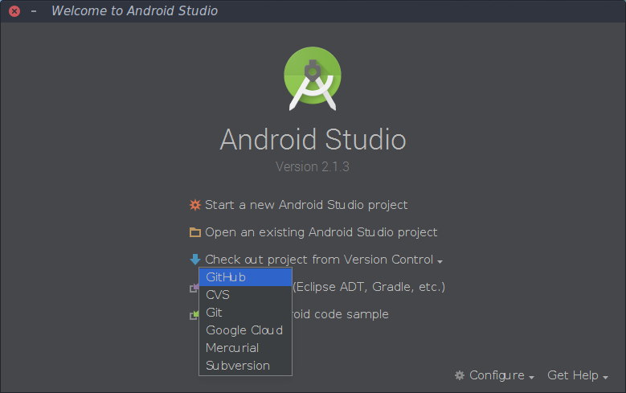

#Source for LTCOE Dashboard APP

#UNDERSTAND GITHUB AND GIT. COMMANDS YOU'LL NEED TO KNOW ARE
1. *git add*
2. *git commit*
3. *git push*
4. *git remote add* (git remote add upstream https://github.com/0xtvarun/LTCOEDashboard)

### And also read up on Pull Requests

[Check this video out for learning git](https://www.youtube.com/watch?v=0fKg7e37bQE)

Download and install [Android Studio and Android SDK](https://developer.android.com/studio/index.html#downloads) from here

Next, you'll need to setup your [github](https://github.com/join) account

__Only for Windows Users__ Install [Gitbash for Windows](https://git-scm.com)

Steps to clone The Source for the App
>1. Click on the fork button for this page, while you are logged into your github account
>2. Go to your  profile and grab the link of your repo, It will be of the form __https://github.com/*username*/LTCOEDashboard.git__
>3. Open Android Studio and Click on the __Check out repo from Verison Control -> GITHUB__ 
>4. Start Contributing :relieved:

**Run this command only Once (git remote add upstream https://github.com/0xtvarun/LTCOEDashboard**

Once the repo has been cloned on your machine, you'll need to run a few commands

1. Before you update your version of the code you'll need to run **git pull upstream master** This command will be needed to run everytime you are done coding and you need to upload the code to your own version of it. running the give command will get you the new additions to the code in the original repository on to your machine. This then needs to be uploaded to your repo.

2. It is possible that someone has made changes to the file you were working on, in such a case the **git** protocol adds a few lines to the file stating the changes by each user these changes will needed to be corrected as they will give syntax error

3. After you are done uploading, now navigate to your version of the code on github.com and on the top left you'll see and tab that reads __New Pull Request__ click that and make a request to add your contribution to the master repository of the code.

For more information on [Pull Requests](https://www.youtube.com/watch?v=oFYyTZwMyAg)

##Important Things to note
1. Testing is very important, hence for every feature you write, it should be accompanied with a Unit Test. To state the obvious the test should pass (duh!):unamused:

2. Please watch this video [Github](https://www.youtube.com/watch?v=0fKg7e37bQE)

3. Please watch this video [Github Pull Requests](https://www.youtube.com/watch?v=oFYyTZwMyAg)

##Work Distribution

| Sr. No | Name      | Task One                      | Task Two                        |
|--------|-----------|-------------------------------|---------------------------------|
| 1      | Aishwarya | Choose Color Pallet           | Network Connecions              |
| 2      | Anagha    | Push Notification             | Handle User Login               |
| 3      | Inderjeet | Handle student and user login | Choose Color Pallet             |
| 4      | Jyotsna   | Prof Specific User Interface  | Prof UI Backend                 |
| 5      | Madhura   | Create a Settings Page        | Database                        |
| 6      | Pratik    | Network Connecions            | Prof UI interface               |
| 7      | Shodhanth | Main Dashboard Backend Java   | Detailed View                   |
| 8      | Siddhi    | Service for database cleanups | Push Notification               |
| 9      | Yatindra  | Main Dashboard Backend Java   | ------------------------------- |
| 10     | Varun     | Main Dashboard Design         | ------------------------------- |
